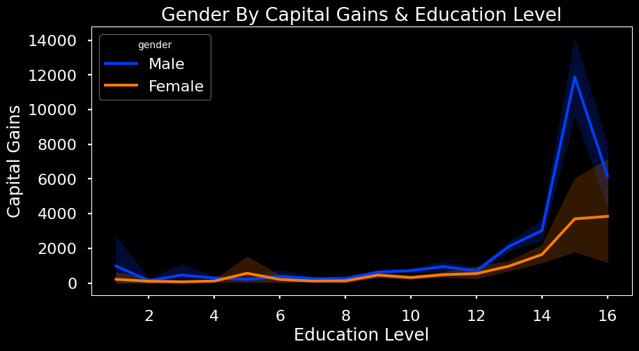

# Adult Income Predictions

The purpose of this notebook is to predict the income level of individuals using a machine learning algorithm. This algorithm will demonstrate insights with regard to what factors lead to which income level. The algorithm predicts two different levels of income. The first level is greater than 50,000 dollars per year. The second level is less than or equal to 50,000 dollars per year. From here, I will refer to these categories as being high income and low income respectively. Based on the below graph, we can see that low income represents a significantly larger portion of the target than high income. Therefore, any predictive algorithm should reach similar results.

The adult income data set used here has a total number of 48,790 entries in the income column. Of these, 37,109 are low income and 11,681 are high income. This means that 79.1% are low income earners and 23.9% are high income earners. The algorithm that I use ought to end up fairly close to this.

# Correlations

One of the findings was that hours per week worked correlated slighltly with the level of education of the individual. A heatmap of all of the numerical column correlations can be seen below. Another one of the slightly more significant correlations was capital gains, which will end up being fairly significant as we move forward. 

Below I have a figure showing how level of education relates to hours worked per week. We can see that an educational level of nine correlates with the average of working forty hours per week, which makes sense. Paired with this figure is a distribution of the level of education of the individuals sampled for this data set. Since most people are well within this educational level of nine, most people work forty hours per week. Based on the below figure, we can also see that high income earners generally work higher hours since income correlates with level of education.

It will be important to note for the rest of this report how significant the correlation between high income earners and capital gains is. Of course, this is not some kind of shocking realization but I will often be using capital gains as a kind of pseudo-proxy for high income, which I believe is a justifiable approach based on the below figure.

This leads to what I believe is quite a fascinating correlation with income. If we compare the above figure and the below figure, what do we see? The two look quite similar when both marital status and income are compared to capital gains. This correlation also exists even when capital gains is factored out in exchange for factors like education and age. Income and marital status have a strong correlation with married people often being high income earners.

Let's take a look at a few other correlations! We have already established the correlation that exists between level of education and high income; however, there is also a fairly significant comparison to be made with age where older individuals typically have higher wages than younger individuals; likely due to more work experience. Below it can be seen that high income roughly corresponds with being older.

The occupation of individuals can tell us a lot about where their income level might be. We can see below that having a profession speciality type job leads to having a high income with an executive managerial role not being too far behind, which makes sense. It's curious to note that the armed forces occupation has a massive error bar, which means there is high variance within that data. The lowest income earners seem to generally be jobs involved in transportation and cleaning.

With regard to race, certain correlations can be seen here too. Asians represent the highest income earners overall with Blacks and Natives representing the lower incomes. White and Other occupy the middle of this data; however, the Other catagory has a massive error bar. Thus, I doubt that a racial status of Other corresponds to income very significantly. 

Gender also can play a role in determining income but not as significantly as one might think and only in certain cases. We can see below that there is a substantial spike in income between men and women after an education level of twelve. Prior to this; however, the data remains quite stable showing that lesser educated men and women generally make similar amounts of money. The real difference is once a certain educational threshold is reached in which mens' incomes increase significantly compared to womens' income.

# Gradient Boosting Model

In order to find the model best suited for this data set, I ran three different machine learning algorithms and tuned them in order to achieve better results. These were the K Nearest Neighbors model, the Random Forest model, and the Gradient Boosting model. Ultimately, I found that the Gradient Boosting model achieved the best predictive results edging just ahead of the K Nearest Neighbors model. This model can achieve accuracy within roughly 16%. It scored nearly 100% on training data and about 83.6% on testing data. Overall, I would recommend this model when predicting the binary income of individuals. I do believe that this algorithm can be made even more efficient in time but even as it stands now, I would recommend deployment.

Below are listed the metrics for the machine learning model I selected. 

        precision    recall  f1-score   support

       <=50K       0.92      0.87      0.89      9700
        >50K       0.59      0.69      0.63      2498

    accuracy                           0.84     12198
    macro avg      0.75      0.78      0.76     12198
    weighted avg   0.85      0.84      0.84     12198
